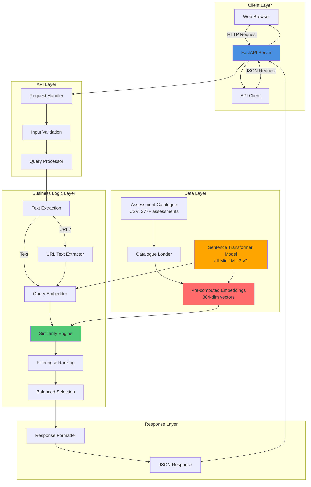
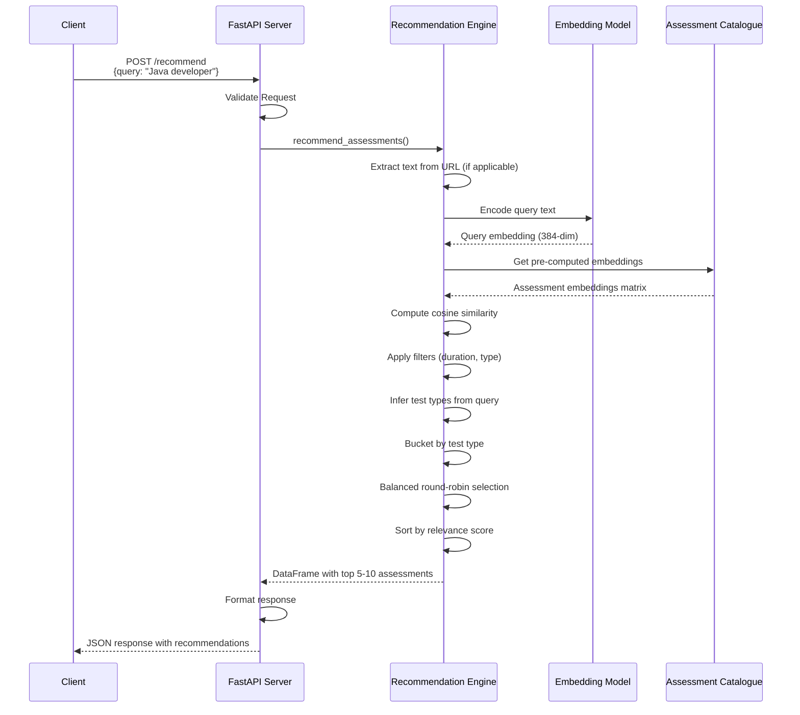
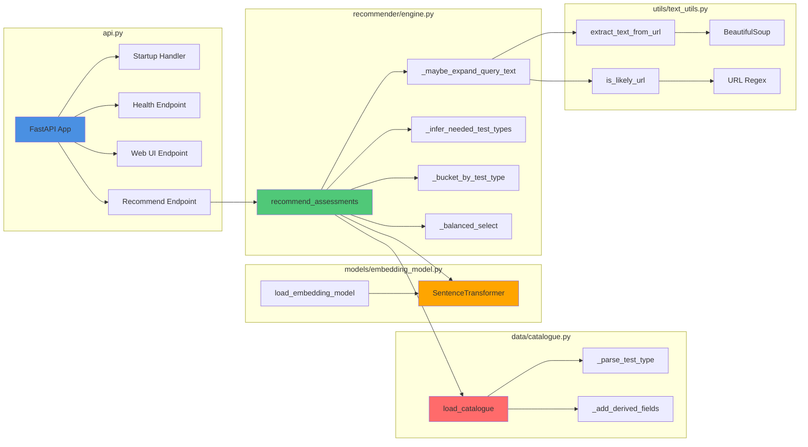
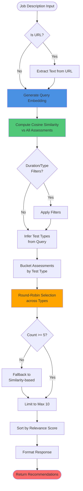
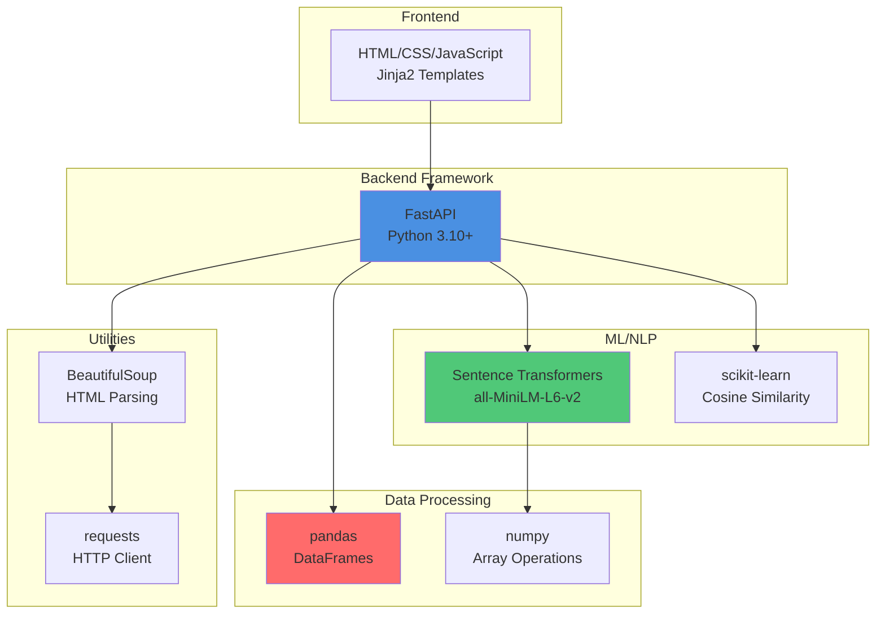
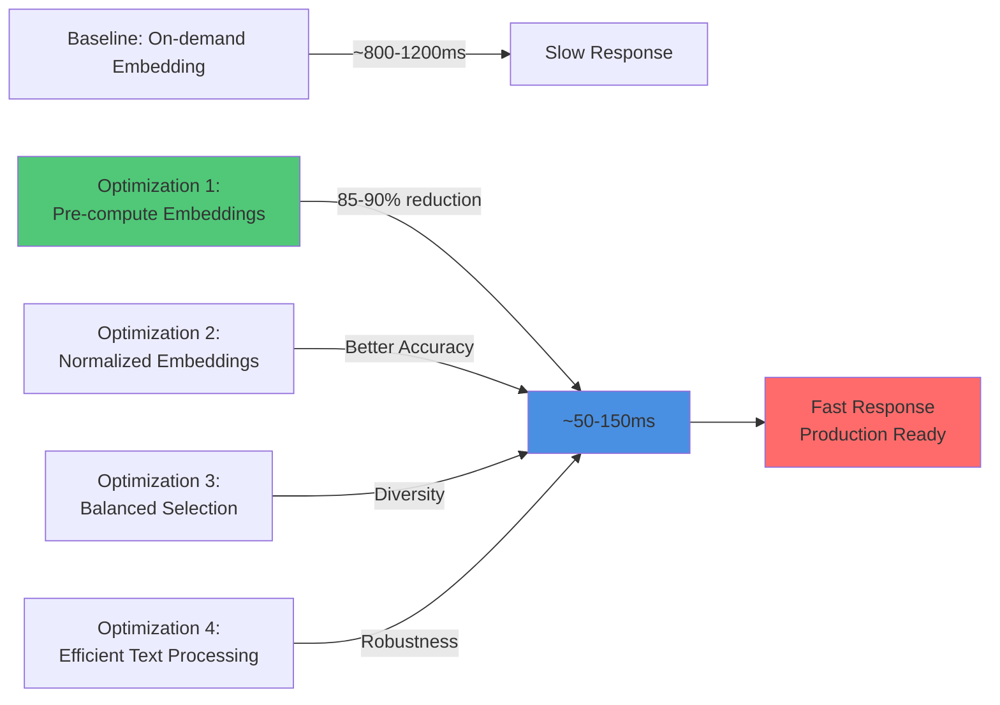
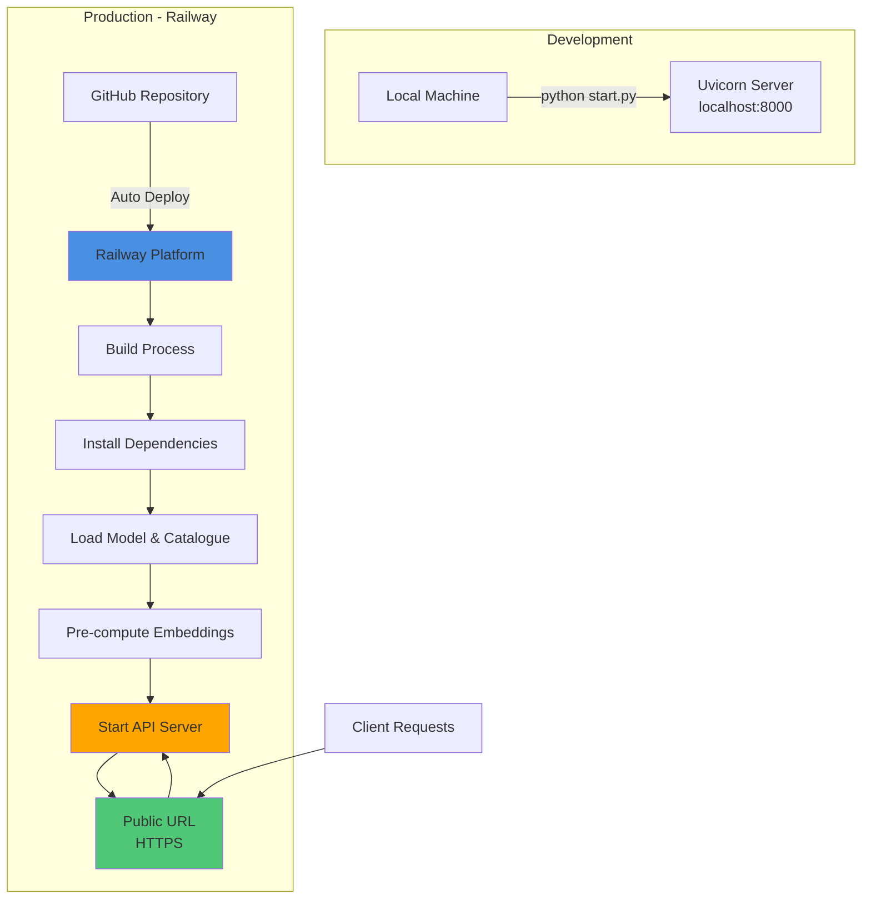
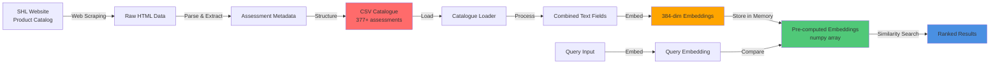

# System Architecture

## Overview

The SHL Assessment Recommendation System is a semantic similarity-based recommendation engine that matches job descriptions to relevant SHL Individual Test Solutions assessments using state-of-the-art NLP techniques.

## System Architecture Diagram

## Data Flow

## Component Architecture

## Recommendation Algorithm Flow

## Technology Stack

## Performance Optimization Strategy

## Deployment Architecture

## Data Pipeline

## Key Design Decisions

1. **Pre-computation**: All assessment embeddings computed at startup (trade-off: 2-3s startup for 50-150ms queries)
2. **Normalized Embeddings**: Unit vectors for reliable cosine similarity
3. **Balanced Selection**: Round-robin across test types for diversity
4. **Fallback Strategy**: Ensures minimum 5 recommendations even if filters are too restrictive
5. **URL Support**: Automatic text extraction from job description URLs
