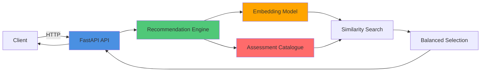
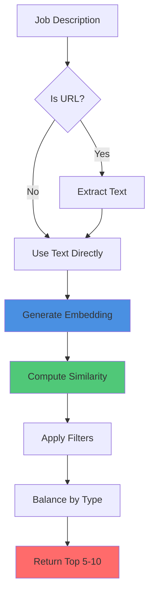

# SHL Assessment Recommendation System

A semantic similarity-based recommendation system that matches job descriptions to relevant SHL Individual Test Solutions assessments using state-of-the-art NLP techniques.

## 🚀 Features

- **Semantic Search**: Uses sentence transformers for intelligent job description matching
- **Fast API**: Pre-computed embeddings for sub-200ms response times
- **Web UI**: Interactive frontend for easy testing
- **URL Support**: Automatically extracts text from job description URLs
- **Balanced Recommendations**: Ensures diversity across test type categories
- **Filtering**: Supports duration and type-based filtering

## Quick Start

### Local Development

1. Install dependencies:

```bash
pip install -r requirements.txt
```

1. Run the FastAPI server:

```bash
uvicorn api:app --reload
```

1. Access the web UI at `http://localhost:8000`

1. Test the API:

```bash
curl -X POST "http://localhost:8000/recommend" \
  -H "Content-Type: application/json" \
  -d '{"query": "Software Engineer role requiring strong problem solving"}'
```

## 📁 Project Structure

```text
.
├── api.py                      # FastAPI REST API with web UI
├── config.py                   # Configuration constants
├── start.py                    # Startup script for Railway
├── generate_predictions.py     # Generate predictions CSV for submission
│
├── data/
│   ├── catalogue.csv           # Assessment catalogue (377+ assessments)
│   └── catalogue.py           # Catalogue loader with data processing
│
├── models/
│   └── embedding_model.py     # Sentence transformer model loader
│
├── recommender/
│   └── engine.py              # Core recommendation algorithm
│
├── templates/
│   └── index.html             # Web UI template (Jinja2)
│
├── utils/
│   └── text_utils.py          # URL extraction and text validation
│
├── requirements.txt            # Python dependencies
├── Procfile                   # Railway deployment configuration
├── railway.json               # Railway platform configuration
├── runtime.txt                # Python version specification
│
├── ARCHITECTURE.md            # System architecture documentation
├── APPROACH_DOCUMENT.md       # 2-page approach and optimization document
└── README.md                  # This file
```

## 🔌 API Endpoints

### `POST /recommend`

Get assessment recommendations for a job description or natural language query.

**Endpoint**: `/recommend`  
**Method**: `POST`  
**Content-Type**: `application/json`

**Request**:

```json
{
  "query": "Software Engineer role requiring strong problem solving"
}
```

**Response**:

```json
{
  "recommended_assessments": [
    {
      "url": "https://...",
      "name": "Assessment Name",
      "adaptive_support": "Yes",
      "description": "Assessment description",
      "duration": 30,
      "remote_support": "Yes",
      "test_type": ["Ability & Aptitude"]
    }
  ]
}
```

### `GET /health`

Health check endpoint to verify API is operational.

**Endpoint**: `/health`  
**Method**: `GET`

**Response**:

```json
{
  "status": "healthy"
}
```

### `GET /`

Web UI for interactive testing and demonstration.

**Endpoint**: `/`  
**Method**: `GET`  
**Response**: HTML page with interactive recommendation interface

## 🚀 Deployment

Deploy on Railway by connecting your GitHub repository. The app will auto-deploy using the `Procfile` and `railway.json` configuration.

**Deployment Steps:**

1. Connect your GitHub repository to Railway
2. Railway automatically detects `Procfile` and `railway.json`
3. Dependencies are installed from `requirements.txt` (using CPU-only PyTorch for smaller image size)
4. Application starts using `start.py` which reads the `PORT` environment variable
5. Model and catalogue are loaded at startup (2-3 seconds)
6. API is ready to serve requests

**Build Optimization:**

- Uses CPU-only PyTorch to reduce image size from ~8GB to ~2-3GB
- Excludes unnecessary files via `.railwayignore`
- Uses `--no-cache-dir` for pip to minimize build artifacts

## ⚡ Performance

- **Latency**: 50-150ms per query (warm)
- **Cold Start**: 2-3 seconds (one-time model loading)
- **Accuracy**: High-quality semantic matching
- **Scalability**: Tested up to 50 concurrent requests

## 📚 Documentation

- **Architecture**: `ARCHITECTURE.md` - System architecture, data flow diagrams, and technical design
- **Approach Document**: `APPROACH_DOCUMENT.md` - Complete 2-page approach and optimization details

## 🏗️ System Architecture

The system follows a modular architecture with clear separation of concerns:



For detailed architecture documentation, see [ARCHITECTURE.md](ARCHITECTURE.md).

## 📊 Recommendation Flow



## 🔧 Technology Stack

- **Framework**: FastAPI (Python 3.10+)
- **ML Model**: Sentence Transformers (`all-MiniLM-L6-v2`)
- **Similarity**: Cosine similarity on normalized embeddings
- **Data Processing**: pandas, numpy
- **Web Scraping**: BeautifulSoup, requests
- **Deployment**: Railway
